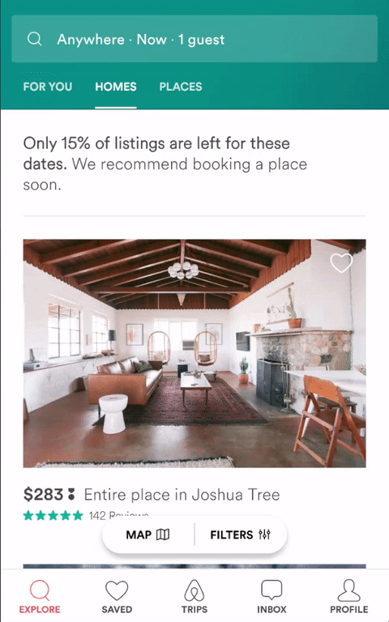
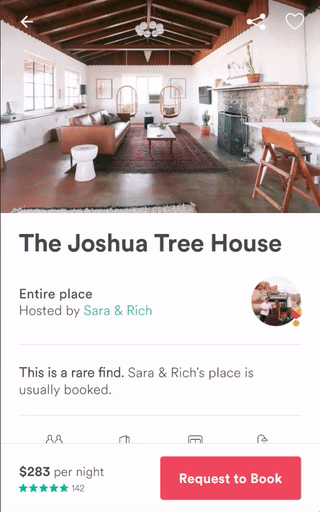

# Lottie for Android (and [iOS](https://github.com/airbnb/lottie-ios))

Lottie is a mobile library for Andorid and iOS that parses [Adobe After Effects](http://www.adobe.com/products/aftereffects.html) animations exported as json with [bodymovin](https://github.com/bodymovin/bodymovin) and renders them natively on mobile!

For the first time, designers can create **and ship** beautiful animations without an enginineer painstakingly recreating it be hand.
* [Painstaking example 1](http://jeremie-martinez.com//2016/09/15/train-animations/)
* [Painstaking example 2](https://blog.twitter.com/2015/hearts-on-twitter)
* [Painstaking example 3](https://medium.com/@crafty/animation-jump-through-861f4f5b3de4#.lvq6k8lb5)

They say a picture is worth 1,000 words so here are 7,000





## Download

Gradle is the only supported build configuration, so just add the dependency to your project `build.gradle` file:

```groovy
dependencies {
  compile 'com.airbnb.android:lottie-android:1.0.0'
}
```


## Alternatives
1. Build animations by hand. Building animations by hand is a huge time commitment for design and engingeering across Android and iOS. It's often hard or even impossible to justify spending so much time to get an animation right.
2. [Facebook Keyframes](https://github.com/facebookincubator/Keyframes). Keyframes is a wonderful new library from Facebook that they built for reactions. However, it only supports a small subset of the features suppoted by Lottie such as masks, mattes, trim paths, dash patterns, and more.
2. Gifs. Gifs are more than double the size of a bodymovin JSON and are rendered at a fixed size that can't be scaled up to match large and high density screens.
3. Png sequences. Png sequences are even worse than gifs in that their file sizes are often 30-50x the size of the bodymovin json and also can't be scaled up.

## Using Lottie
Lottie animations are rendered by `LottieAnimationView`. `LottieAnimationView` animations are defined by a `LottieComposition`.
You can load a composition directly with `LottieComposition.fromFile(...)` which will look in `src/main/assets` or `LottieComposition.fromJson(...)` if you have a raw JSONObject (useful for loading animations from the newtork).

However, the simplest way to use it is with an xml attribute or to let LottieAnimationView load the composition:

```
<com.airbnb.lottie.LottieAnimationView
        android:id="@+id/animation_view"
        android:layout_width="wrap_content"
        android:layout_height="wrap_content"
        app:lottie_fileName="hello-world.json"
        app:lottie_loop="true"/>
```

Or you can load it programatically:
```
LottieAnimationView animationView = findViewById(R.id.animation_view);
animationView.setAnimation("hello-world.json");
animationView.loop(true);
animationView.playAnimation();

```

## Why is it called Lottie?
Lottie is named after a German film director and the foremost pioneer of silhouette animation. Her best known films are The Adventures of Prince Achmed (1926) – the oldest surviving feature-length animated film, preceding Walt Disney's feature-length Snow White and the Seven Dwarfs (1937) by over ten years
[The art of Lotte Reineger](https://www.youtube.com/watch?v=LvU55CUw5Ck&feature=youtu.be)

##Try it out
Clone this repository and run the LottieSample module to see a bunch of sample animations. The JSON files for them are located in [/assets](https://github.com/airbnb/lottie-android/tree/master/LottieSample/src/main/assets).

## Contributing
Contributers are more than welcome. Just upload a PR with a description of your changes.
Lottie uses [Facebook screenshot tests for Android](https://github.com/facebook/screenshot-tests-for-android) to identify pixel level changes/breakages. Please run `./gradlew --daemon recordMode screenshotTests` before uploading a PR to ensure that nothing has broken.

If you would like to add more JSON files and screenshot tests, feel free to do so and add the test to `LottieTest`.
