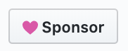

# Lottie for Android, [iOS](https://github.com/airbnb/lottie-ios), [React Native](https://github.com/airbnb/lottie-react-native), [Web](https://github.com/airbnb/lottie-web), and [Windows](https://aka.ms/lottie)


<a href='https://play.google.com/store/apps/details?id=com.airbnb.lottie'></a>

Lottie is a mobile library for Android and iOS that parses [Adobe After Effects](http://www.adobe.com/products/aftereffects.html) animations exported as json with [Bodymovin](https://github.com/airbnb/lottie-web) and renders them natively on mobile!

For the first time, designers can create **and ship** beautiful animations without an engineer painstakingly recreating it by hand. They say a picture is worth 1,000 words so here are 13,000:

# Sponsors
Lottie is maintained and improved on nights and weekends. If you use Lottie in your app, please consider sponsoring it to help ensure that we can continue to improve the project we love.
Click the sponsor button above to learn more



## Lead Sponsors
<a href="https://www.lottiefiles.com/"></a>

<a href="https://lottielab.io/"></a>

<a href="https://www.airbnb.com/"></a>

<a href="https://www.tonal.com/"></a>

<a href="https://getstream.io/chat/sdk/android/?utm_source=OpenCollective&utm_medium=Github_Repo_Content_Ad&utm_content=Developer&utm_campaign=OpenCollective_Jan2022_AndroidChatSDK"></a>

<a href="https://www.coinbase.com/"></a>

## View documentation, FAQ, help, examples, and more at [airbnb.io/lottie](http://airbnb.io/lottie/)


## Download

Gradle is the only supported build configuration, so just add the dependency to your project `build.gradle` file:

```groovy
dependencies {
  implementation 'com.airbnb.android:lottie:$lottieVersion'
}
```
The latest Lottie version is:


The latest stable [Lottie-Compose](http://airbnb.io/lottie/#/android-compose) version is:

Click [here](http://airbnb.io/lottie/#/android-compose) for more information on Lottie-Compose.

Lottie 2.8.0 and above only supports projects that have been migrated to [androidx](https://developer.android.com/jetpack/androidx/). For more information, read Google's [migration guide](https://developer.android.com/jetpack/androidx/migrate).

# Contributing

Because development has started for Lottie Compose, Gradle, and the Android Gradle Plugin will be kept up to date with the latest canaries. This also requires  you to use Android Studio Canary builds. [Preview builds](https://developer.android.com/studio/preview) can be installed side by side with stable versions.
